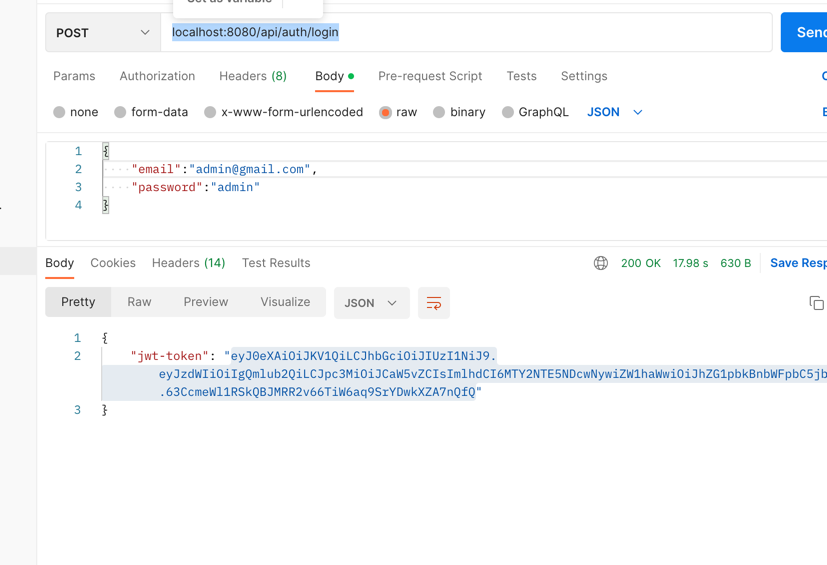
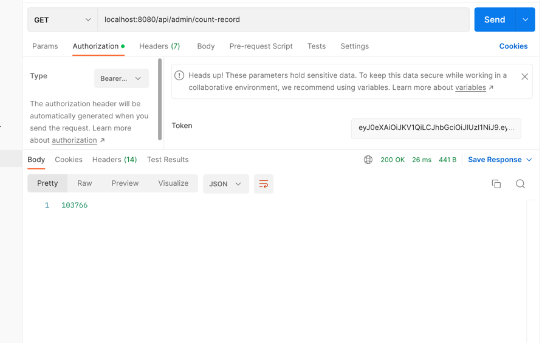

# spring-batch

#How to run application

clone the repository by using following command. 
`git clone https://github.com/devbinod/spring-batch.git`

then go to repository using `cd spring-batch` 

then run application using `docker-compose up`

Open postman 
and select `post` method and use `localhost:8080/api/auth/login` url for <b>login</b>

and send username `admin@gmail.com` and password `admin` as a request body payload.

`{
"email":"admin@gmail.com",
"password":"admin"
}`
and then server will give you authorization token. See following screenshot.

#To Run Batch Job.

create a new tab on postman and put use bearer as a authorization type <b>`bearer`</b>
and use `localhost:8080/api/admin/run-batch` url. 

This <i>endpoint</i> will run batch job.

#For counting result use following `get` end point.
`localhost:8080/api/admin/count-record`

this endpoint will give you no of record exist on the database.

